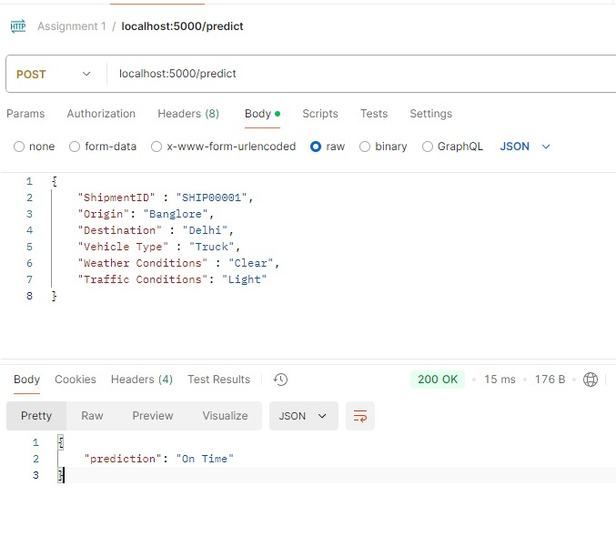

# Shipment Delay Prediction
To predict whether a shipment will be delayed or on time based on data such as shipment details, vehicle type, weather conditions, traffic, and distance. Created a flask app and an API and test it using Postman


## Installation 

Install the requiremens using the following command:  
```pip install -r requirements.txt```

---

## Running the app

run ```app.py``` to start the flask app and set up the Postman agent.
To set up the Postman agent
1. Select the ```POST``` option and set the URL as 
```localhost:5000/predict```

2. In the input field enter the input details in a ```JSON``` format as follows:

```
{
    "ShipmentID" : ,
    "Orgin" : ,
    "Destination" : ,
    "Weather Conditions" : ,
    "Weather Conditions" :
}
```

3. Hit send and in the input section the Prediction would be shown if the shipment is "On Time" or "Delayed"



